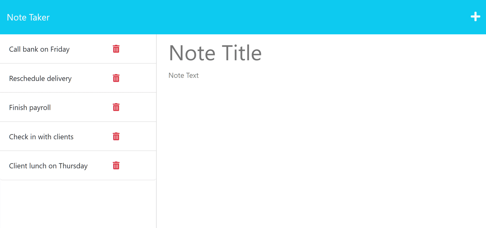

# NoteTakerPro

In this assignment, taking base code given, we created and wrote more code to add on to the base code given to make a note taker site. Edited code to be able to npm i and npm run the code to launch the site that will be able to let us take notes on this. Attempted to work on WIP parts to make the code be able to launch.

The site does not launch on github but it does run on localhost:3000

